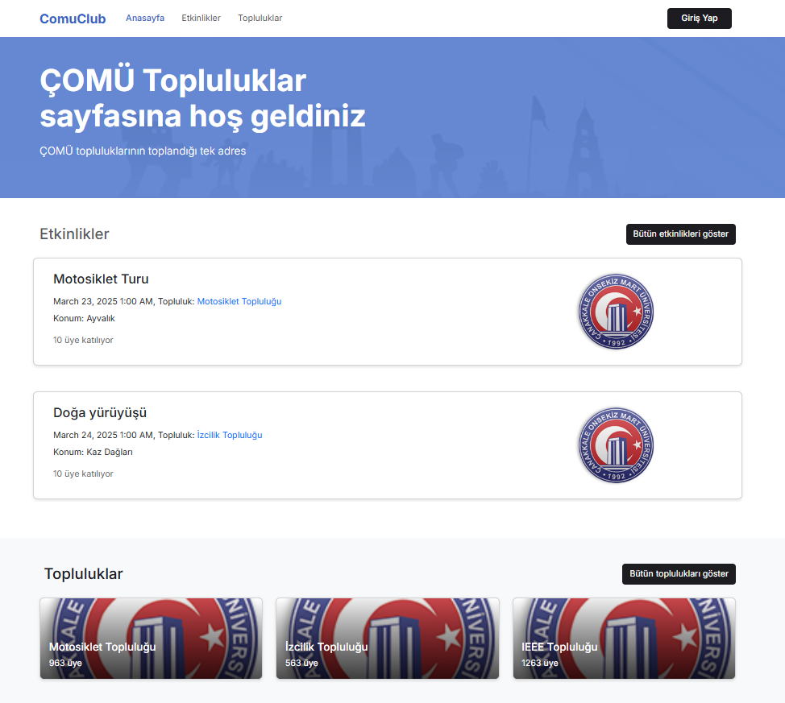
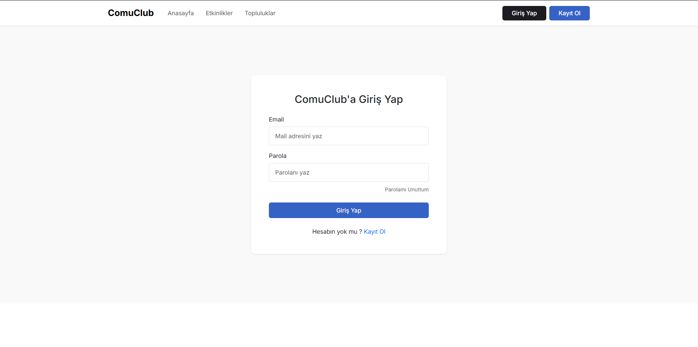
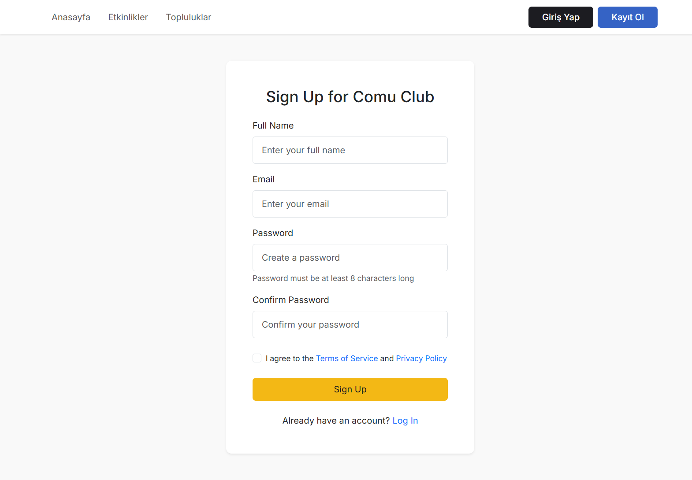
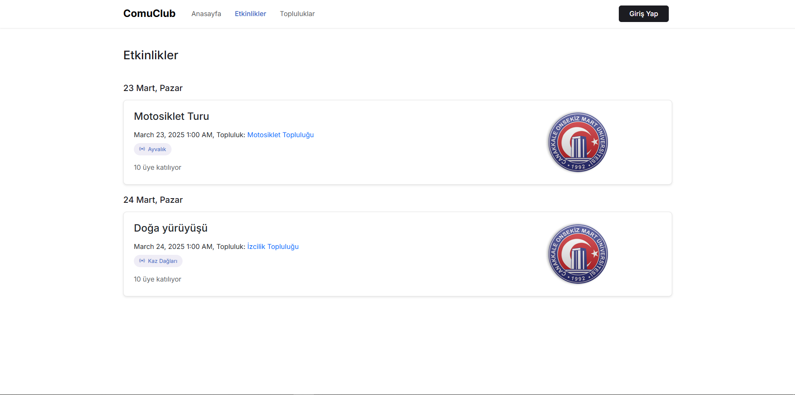
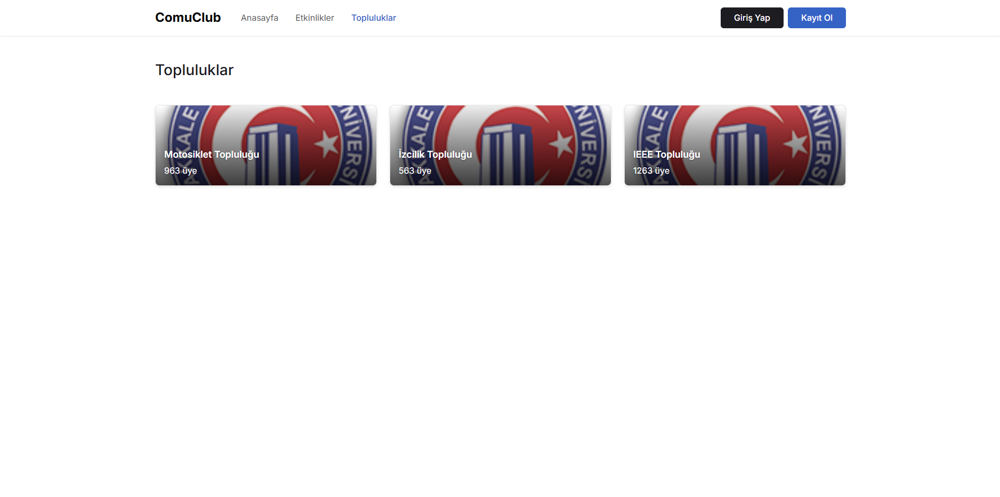

# 📌 Proje Adı

Projemiz Çanakkale Onsekiz Mart Üniversitesinde bulunan Kulüplerin etkileşimlerini arttırabilmek ve daha fazla insana ulaşabilmesi için bir platform olmayı hedefliyor. 
Temelde her kullanıcı ister giriş yaparak isterse de anonim olarak Çanakkale Onsekiz Mart Üniversitesindeki kulüp ve etkinliklerden haberdar olabilir.
İsterlerse de etkinliklere katılmak için kayıt olabilirler.

Etkinliklere kayıt olmanın zorunluluğu tamamen kulübün insiyatifindedir.

## 🚀 Başlangıç

Aşağıdaki talimatları takip ederek projeyi yerel bilgisayarınızda çalıştırabilirsiniz.

### 📋 Gereksinimler

## API için
Visual Studio   : [https://visualstudio.microsoft.com/tr/vs/]  
.Net SDK        : [https://dotnet.microsoft.com/en-us/download]  
SQL Server      : [https://www.microsoft.com/en-us/sql-server/sql-server-downloads]  

## UI için
Visual Studio Code : [https://code.visualstudio.com]  
Node JS            : [https://nodejs.org/en]  

### 🔧 Kurulum

## UI Kurulum
1. Depoyu klonlayın:
   ```bash
   git clone https://github.com/erenkta/Comuclub.git
   ```
2. Proje dizinine gidin:
   ```bash
   cd UI/Comuclub
   ```
3. Gerekli bağımlılıkları yükleyin:
   ```bash
   npm install
   ```
4. Uygulamayı çalıştırın:
   ```bash
   npm start  
   ```

## API Kurulum
1. Depoyu klonlayın:
   ```bash
   git clone https://github.com/erenkta/Comuclub.git
   ```
2. Proje dizinine gidin:
   ```bash
   cd API/Comuclub
   ```
3. Gerekli bağımlılıkları yükleyin:
   ```bash
   dotnet restore
   ```
4. Uygulamayı çalıştırın:
   ```bash
   dotnet run
   ```


   ## 🖼️ Uygulama Ekran Görüntüleri

Aşağıda, uygulamanın bazı ekran görüntülerini bulabilirsiniz. 👇

### 📱 Ana Sayfa
**Uygulamamızın Ana Ekranı. Bu ekrandan [Etkinlik](#etkinlikler) ve [Topluluklar](#topluluklar) sayfalarına erişebilirsiniz.**


### 🔐 Giriş Sayfası
**Uygulamamıza burdan giriş yaparak ekstra özelliklere sahip olabilirsiniz.**


### 📝 Kayıt Sayfası
**Uygulamamıza burdan kayıt olarak hesap oluşturabilirsiniz.**


### 🎉 Etkinlikler
**Etkinlikler sayfasında yaklaşan etkinliklere göz atın.**


### 👥 Topluluklar
**Okulumuzdaki topluluklara göz atın.**


